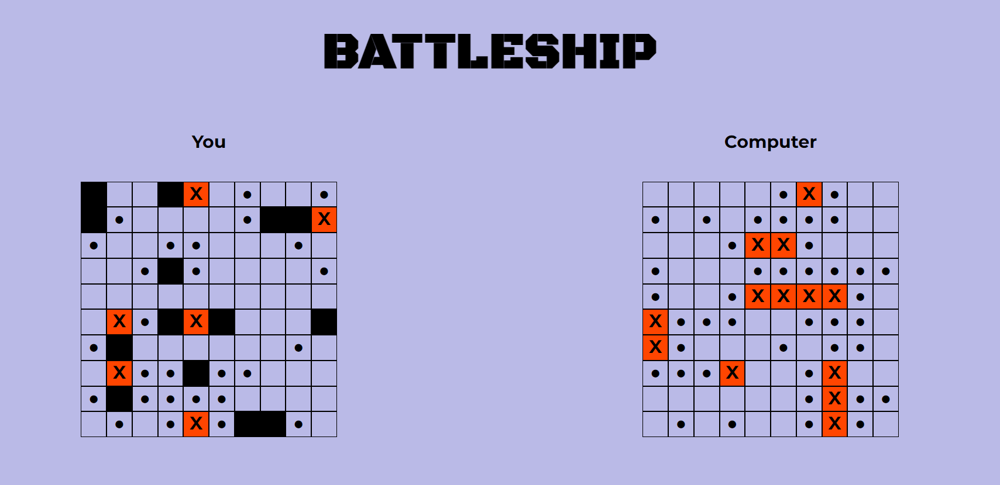

# Battleship

## This is my project developed while learning basic CSS and JS.
It was created as part of [The Odin Project](https://www.theodinproject.com) course. 
In this project, I practiced writing complex game logic using factory functions 
and explored implementing Jest testing.

## Skills Practiced
- JavaScript (ES6)
- Factory functions
- DOM Manipulation
- Jest

## Screenshot

